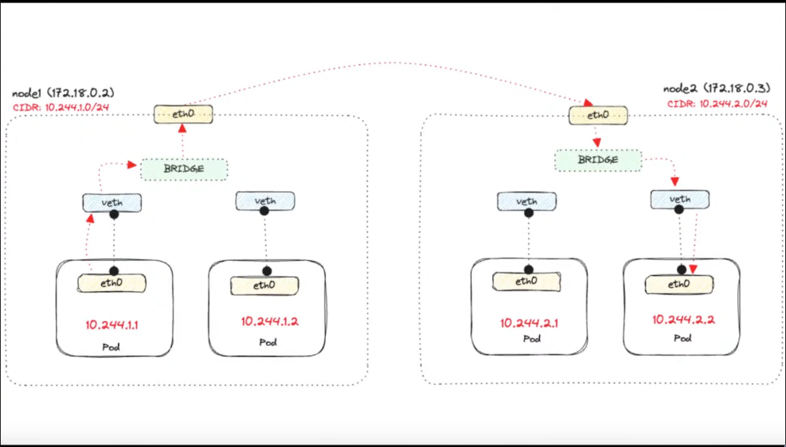
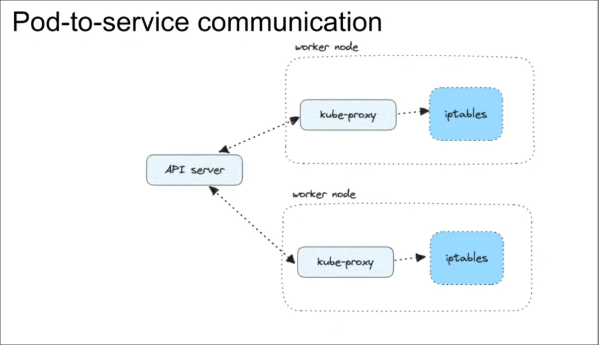
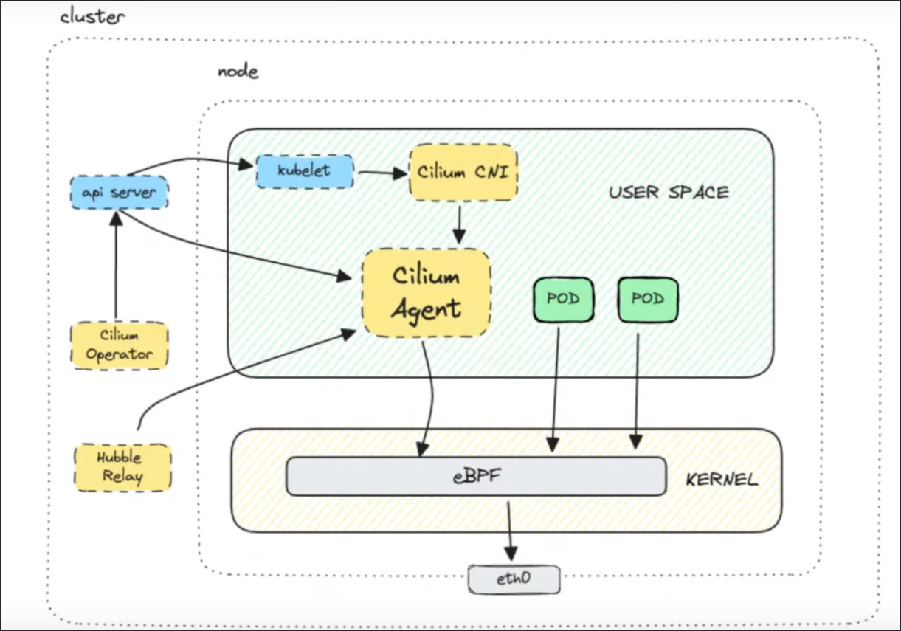
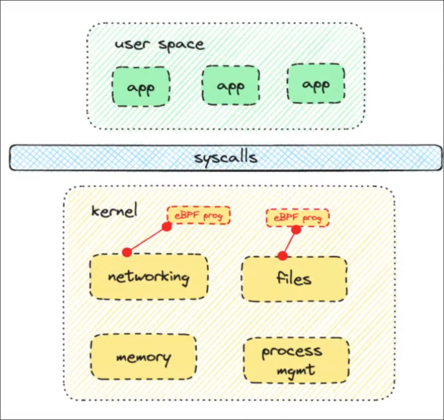
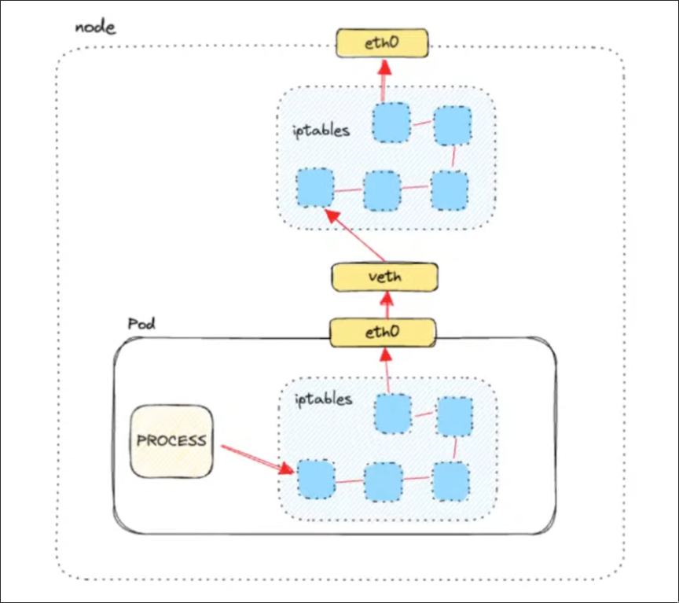
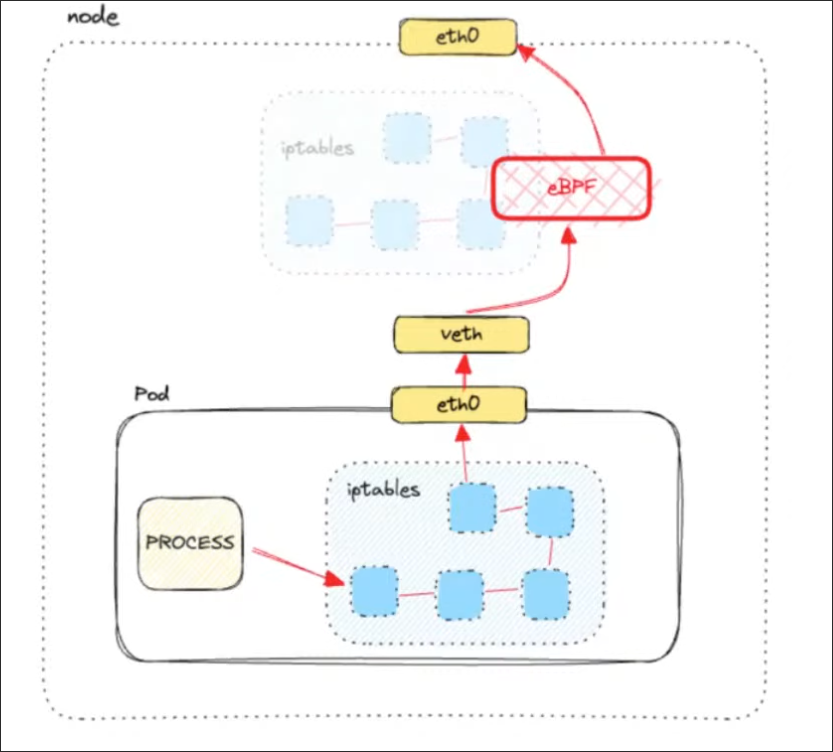
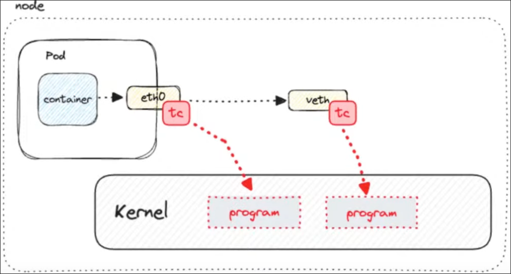

# Basic kubernetes networking

### Pod to pod communication


### Pod to service communication


### External Communication
* Egress
  * iptables: source pod IP -> internal node/vm IP
  * IGW for NAT: internal VM IP -> public node IP
* Ingress
  * LoadBalancer service -> external IP
  * Ingress and ingress controller for routing to correct service

### Kube-proxy
* Runs on every node
* Keeps services and ep up to date 
* Manages routing rules on the nodes
It has 4 modes:
* userspace -> uses iptables but runs as a web service on the userspace(should not be used)
* kernelspace -> windows only
* iptables -> gets slow with more rules
* ipvs -> its faster than iptables

### CNI
Its a spec that acts between the container runtime(cri) and the network implementation, it is used when a container gets created or removed <br>
It is responsible for:
* IPAM -> IP address management
* Setting up routes

#### Contract
* ADD -> Adds a container to the network, and returns the created interfaces IPs
* DELETE -> Removes a container from the network, releases resources
* CHECK -> Checkes whether the container network is set up properly
* VERSION -> Returns CNI versions supported by the plugin
It should be implemented as a binary + config

# Cilium Architecture
Cilium is a cloud native solution that provides secure and observable network connectivity between workloads based on eBPF <br>


## IPAM
Within cilium you can pick which IPAM method to use <br>
* cluster-scope (default) - CiliumNode resource
* Kubernetes host-scope - Node resource
* CRD-backed
* Azure IPAM
* AWS ENI
* AWS ENI
* AWS ENI
* AWS ENI
* AWS ENI
* AWS ENI
* AWS ENI
* AWS ENI
* GKE uses host scope

## kube-proxy replacement
Cilium CNI has 3 different modes to replace or not the kube-proxy
* Disabled (default)
  * All functionality is performed by the kube-proxy
* Parital
  * Hybrid approac where you can pick and choose the functionality to be handled by Cilium
* Strict
  * Cilium handles all kube-proxy functionality

## eBPF and Cilium
Cilium uses eBPF which acts in the kernel space to process packets, other CNI's uses iptables which run on userspace to handle the packages, since it operates at the kernel level it is faster processing said packages and allows for better scaling <br>
-- side note on ebpf -> it allows to run sandbox programs in the kernel without going back and forth the userspace and the kernelspace (reducing the possible abstraction layers)

The diagram below is a high level overview on how iptables handles networking wihtin kubernetes

The diagram below is a high level overview on how eBPF handles networking within kubernetes

eBPF basically bypasses the userspace getting direct access to the network interface to handle all the networking
### Hooks used by Cilium
* Express Data Path (XDP) BPF Hook
  * Runs when a packet is received before any other processing happens(bypasses most of the network stack, highly used for DDoS mitigation)
* Traffic control (tc) ingress/egress(this hook runs after the processing is done)

* Socket Operations
  * Attached to specific cgroups and runs on TCP events, attached to the root cgroup,used for monitoring TCP state transitions
* Socket send/recv
  * Runs on every send operator, the program can inspect the message then either drop it, send it to TCP layer or redirect to another socket

## Features
* Connecting workloads -> Flat L3 network and overlay networking model
* Enforcing network Policies
  * NetworkPolicy or CiliumNetworkPolicy
  * Uses Envoy for L7 path
* Visualizing network traffic flows
  * Hubble
  * Prometheus metrics
* Encryption using IPSec or Wireguard

## Install Cilium
In order to deploy cilium in your cluster you can use either the CLI or install it via helm
### CLI Install
```(bash)
cilium install [flags]
```
### Helm install
```(bash)
helm repo add cilium https://helm.cilium.io/
helm install cilium cilium/cilium --values values.yml
```
