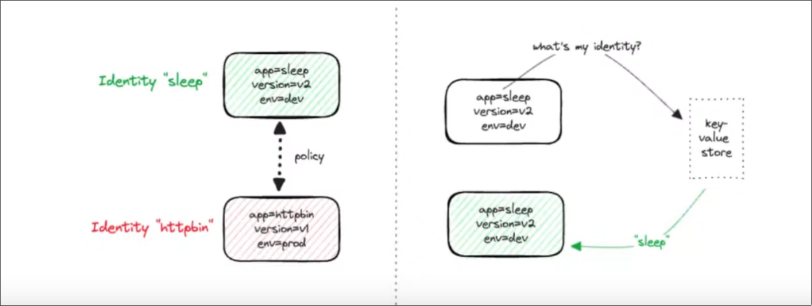

# Network Policy and Observability
Calico uses an identity based security model
* Separate security from network addressing

Kubernetes uses a KV store to track the policies attached to the pods, usually its done via labels
## Kubernetes Network Policies 
Default k8s network policies does not support L7 rules.
The podSelector is namespaced
### Ingress Scheme
```(yaml)
- matchLabels
  - from
    - podSelector
    - namespaceSelector
    - ipBlock
  - ports
  - to
    - podSelector
    - namespaceSelector
    - ipBlock
  - ports
```

### Example
```(yaml)
apiVersion: networking.k8s.io/v1
kind: NetworkPolicy
metadata:
  name: test-np
  namespace: default
spec:
  podSelector:
    matchLabels:
      role: db
    policyTypes:
       - Ingress
       - Egress
    ingress:
    - from:
      - ipBlock:
        cidr: 172.17.0.0/16
        except:
          - 172.17.0.1/24
      - namespaceSelector:
        matchLabels:
          project: myproject
      - podSelector:
          matchLabels:
            role: frontend
  ports:
    - protocol: TCP
      port: 6379
  egress:
    - to:
      - ipBlock:
        cidr: 10.0.0.0/24
    ports:
      - protocol: TCP
        port: 5978
```
### Missing features
* Lack of L7 support
* No cluster wide support
* Anything TLS related
* Node specific policies
* Logging network security events
* Explicit deny policies(allow by default)

## Cilium Network Policy
### What is implemented by Cilium
* Has a np CRD
* CiliumNetworkPolicy CRD
  * Adds L7 via envoy support for http,grpc,kafka
  * Enhanced ingress and egress policies
  * Deny policies
* CiliumClusterWideNetworkPolicy
  * Cluster scoped
  * Enabled node selectors

Whenever cilium detects L7 traffic it spins up an envoy proxy inside of the cilium agent pod

### Structure
* Endpoint selector
  * matchLabels
* Ingress
  * fromCIDR/fromCIDRSet
  * fromEndpoints(fromRequires)
  * fromEntities
    * all,world,cluster,host....
  * toPorts
  * icmps
* Egress
  * toCIDR/toCIDRSet
  * toFQDNs -> needs DNS proxy enabled
  * toServices
  * toEndpoints(toRequires)
  * toEntities
    * host
    * remote-node
  * toPorts
  * icmps

### Example
```(yaml)
apiVersion: cilium.io/v2
kind: CiliumNetworkPolicy
metadata:
  name: l7policy
spec:
  endpointSelector:
    matchLabels:
      app: hello-world
  ingress:
  - toPorts:
    - ports
      - port: "80"
        protocol: TCP
      rules:
        http:
        - method: GET
          path: "/api"
        - method: PUT
          path: "/version"
          headers:
          - "X-some-header: true"
```
### L7 visibility
* By default L3 and L4 packet events only
* L7 visibility if you configure an L7 policy
* use pod annotation for L7 vibility *without* policy
- <{Traffic Direction}{L4 Port}/{L4 Protocol}/{L7 Protocol}>
