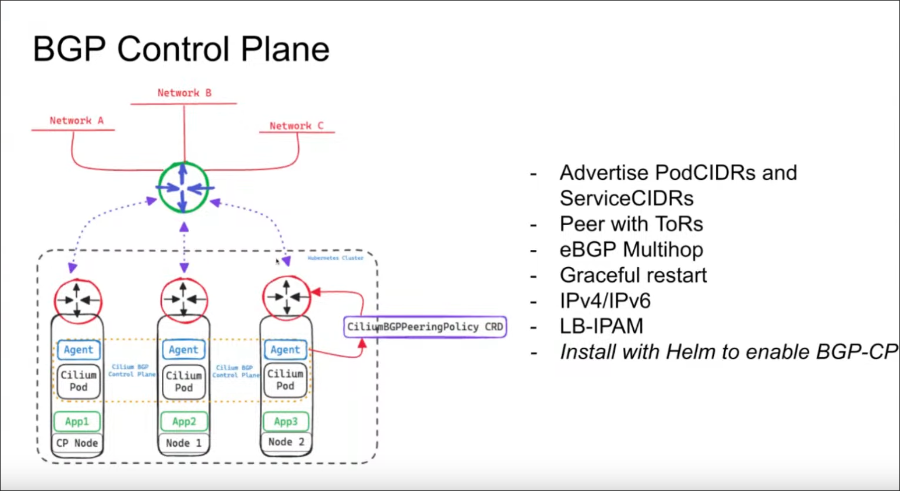
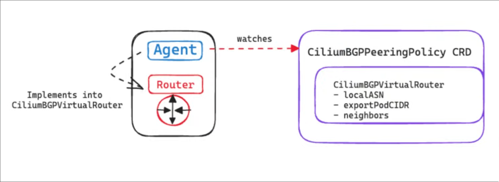
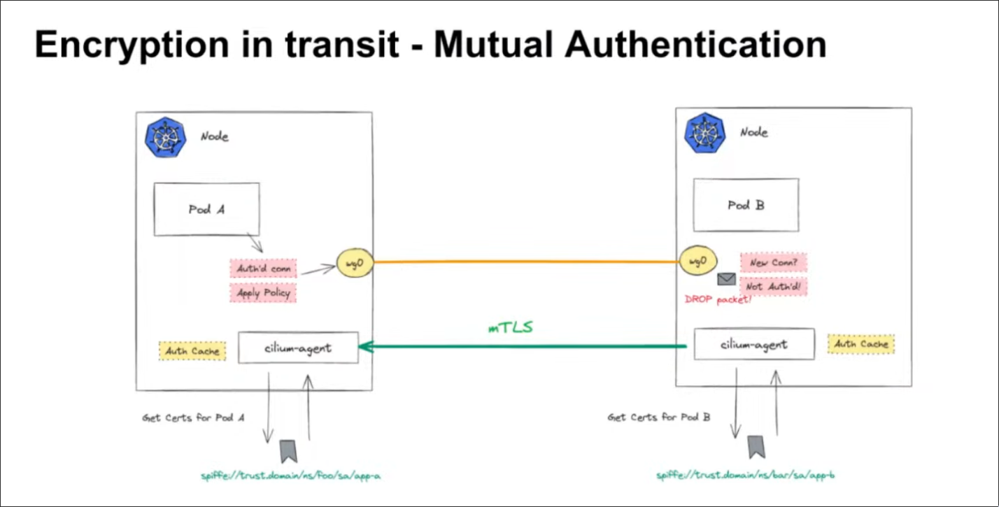
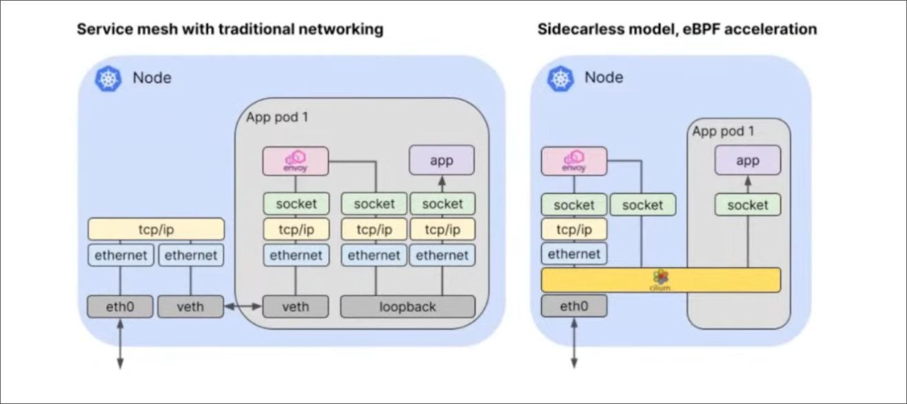
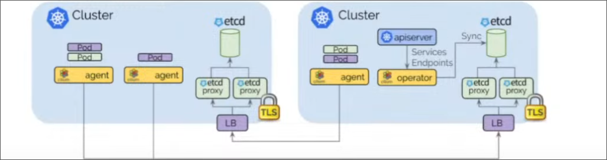

## BGP
BGP stands for the border gateway protocol,there are 2 versions of BGP
* iBGP -> Internal Border gateway protocol, used to exchange network information
* eBGP -> External Border gateway protocol, it uses AS(autonomous systems) to handle the network information/updates
Cilium has a BGP controller, which is useful when there's a need to have completely separate workloads know to communicate with each other, it has the following available object <br>
* CiliumBGPPeeringPolicy
  * Topology
* CiliumBGPVirtualRouter
  * Local Logical Router
* CiliumLoadBalancerIPPool
  * ServiceIP Pool
* CiliumBGPNeighbor
  * Attributes of the peer
In order to have BGP enabled in cilium the config should have:
```(yaml)
---snip---
bgpControlPlane:
  enabled: true
```


### Example of BGP Peering Policy
```(yaml)
apiVersion: cilium.io/v2alpha1
kind: CiliumBGPPeeringPolicy
metadata:
  name: test
spec:
  nodeSelector:
    matchLabels:
      kubernetes.io/os: linux
  virtualRouters:
    - exportPodCIDR: true
      localASN: 65100
      neighbors:
        - peerASN: 6500
          peerAddress: 172.22.0.5/32
      serviceSelector:
        matchLabels:
          app: nginx
```
## External Networking(vxlan)
Usually when there's a need to add external workloads like VM's or other services into kubernetes, if done at a small scale thats when vxlan come into play. <br>
Requirements:
* K8s for ID allocation
* Docker
* IP connectivity to k8s nodes
* Unique IPs
* Allow ports via firewall

It uses elements of clulster-mesh to create connectivity to nodes(VM's or baremetal) outside the cluster <br>
as a note cilium currently doesn't support encryption on these cases.<br>
In order to have this up and running:
* Install cilium with tunnel=vxlan
* Enable clustermesh with the LoadBalancer service and enable external workloads
* Tell cluster about external workloads
  * CiliumExternalWorkload
* Deploy and install Cilium on the external workload node
* Test the connectivty

## Egress Networking
Cilium has the capability to route all ipv4 connections originating from pods inside a cluster destined to external subnets/CIDR's using specific nodes as exit-nodes within the cluster.
* Exit nodes can be called Gateway nodes
* SNAT is used for internal pods
* its similar to NAT/PAT overload clients to a single public IP address
## Service Mesh
### Service Mesh use cases
* Resiliency -> Survive different network conditions
* L7 Traffic Management -> Route based on http attributes
* Identity-based Security -> Checks the identity of the services
* Observability and tracing -> provides logs,traces,metrics and latency
* Transparency -> It's transparent for the applications
### Cilium Service Mesh
* Provides a k8s ingress
* GW API support
* Mutual auth
* L7 aware traffic mgmt
### Cilium Ingress
* standard k8s ingress
* ingress class = Cilium
* Dedicated vs shared LB for ingress
* Several supported annotations for ingress capabilities
* Limited support for advanced routing
* Limited protocol support (HTTP/HTTPS)
* No RBAC-like model
### GW API
* Successor to ingress
* Role oriented,portable,expressive, extensible
* GW API support for:
  * GatewayClass
  * Gateway(cilium)
  * HTTPRoute
  * TLSRoute(exp)
  * ReferenceGrant
* Support for HTTP Routing, TLS termination, traffic split/weight header modification
* Support for policies for external traffic, no more annotations
* Flexible customization
* RBAC personas
## Encryption in transit  
### Transparent Encryption
Cilium offers transparent encryption to cilium managed hosts and endpoints, using wireguard or IPSec
* IPSec
  * Intranode = no encryption
  * Internode = encryption
  * flag -> --set encryption.type=ipsec
* Wireguard
  * Same as above for intra/inter node
  * Faster than IPSec (Doesn't negotiate protocols nor PSK)
  * flag -> --set encryption.type=wireguard
### Mutual Authentication

## Sidecar vs Sidecar-less with Cilium

### Sidecar
* Uses of Envoy in datapath
* Traffic mgmt
  * L7 LB and ingress
* Resilience
  * Retries,L7 Rate Limits
* Security
  * TLS termination + origination
* + sidecar-less features
### Sidecar-less
* Traffic mgmt
  * L3/L4 forwarding and LB
  * Canaries
  * Topology aware Routing
  * Multi cluster
* Security
  * Network Policy, mTLS
* Observability
  * Tracing, OTEL, metrics
  * HTTP,TLS,DNS,TCP/UDP
## Cluster mesh
It allows the extension of the dataplane/data-path of pods across multiple clusters, so they are grouped as one logical cluster, it uses KVSToreMesh to cache remote cluster info.
### Why?
* Private cloud environment, more control over resources/workloads
* Hybrid workload and infra environments
* On-ramp
* HA,DA,DR, Maintenance

It requires a CA.
### Requirements
* Encapsulation or native-routing mode
* non overlapping PodCIDRs across clusters
* non overlapping node-IPs
* All nodes in all clusters need NxN IP connectivity
  * Peering or VPN for the underlay network
* Non-blocking of ports required for cross cluster control/data-plane comms
## Setup
* Specify cluster name/id
* shared CA
* Enable Cluster Mesh
* Connect clusters
* Test Pod Connectivity between clusters
## Considerations
* LB and service discovery
  * Global vs Shared
* Service Affinity
  * Used to localize service calls to limit unnecessary traffic hairpinning
* Network Policies
  ```(yaml)
  apiVersion: cilium.io/v2
  kind: CiliumNetworkPolicy
  metadata:
    name: "allow-cross-cluster"
  spec:
    description: "Allows podX in clusterA to communicate with podZ on clusterB"
    endpointSelector:
      matchLabels:
        name: podX
        io.cilium.k8s.policy.cluster: clusterA
    egress:
    - toEndpoints:
      -matchLabels:
        name: podZ
        io.cilium.k8s.policy.cluster: clusterB
  ```
