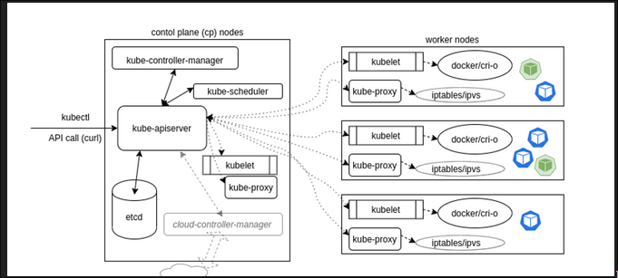
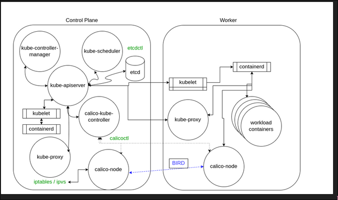
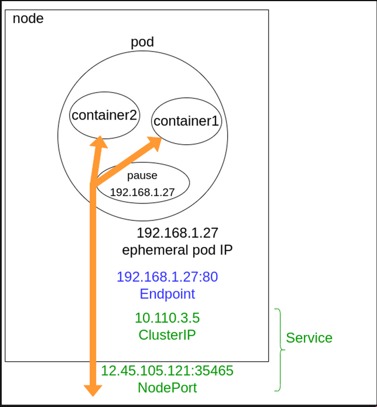
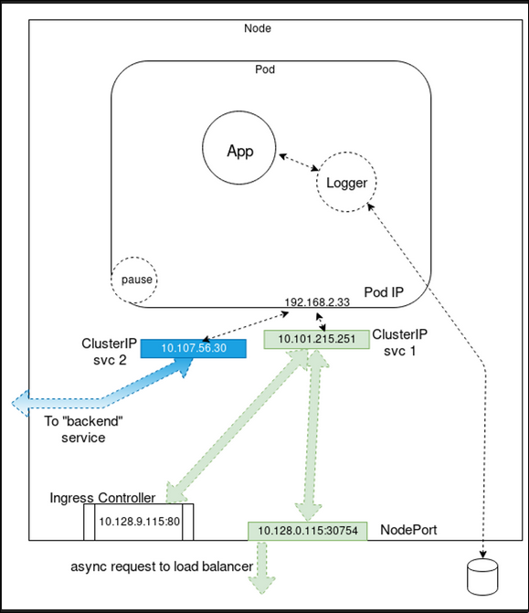

# kubernetes_architecture

Kubernetes has the following main components:

- Control plane(s) and worker node(s)
- Operators
- Services
- Pods of containers
- Namespaces and quotas
- Network and policies
- Storage.



# Control Plane Node Components

## kube-apiserver

It’s the central piece to the kubernetes operations, all calls(internal and external) are handled by this agent, all actions are accepted and validated by this agent, it is the only connection to the etcd database

## kube-scheduler

Is in charge to place pods into a node via an algorithm, attempts to view the available resources to bind and then try and retry to deploy the pod based on the availability and success, a bypass can be done using taint and tolerations to place the pod into the node but it can be on pending state depending on the resources

## etcd database

is the component that stores the state of the cluster, networking and other persistent information, the values are always appended to the end, previous copies of the data are marked for future removal by a compaction process.

Simultaneous requests to update a value all travel via the **kube-apiserver**, which then passes along the request to **etcd** in a series. The first request would update the database. The second request would no longer have the same version number, in which case the **kube-apiserver** would reply with an error 409 to the requester. There is no logic past that response on the server side, meaning the client needs to expect this and act upon the denial to update.

There is a leader database along with possible followers or non voting learners, who are in the process of joining the cluster, they all communicate with each other to determine which will be the Leader and determine another in the event of a failure

Before upgrades or maintenance, you should plan on backing up **etcd**. The **etcdctl** command allows for **snapshot save** and **snapshot restore**

## kube-controller-manager

Control loop daemon that interacts with the kube-apiserver to determine the state of the cluster, if the state doesnt match it will contact the necessary controler to match the desired state

## cloud-controller-manager

Interacts with agents outside of the cloud, it handles tasks that were handled by the kube-controller-manager

# Worker node components



## kubelet

Interacts with the container engine and make sure that the containers that need to run are running.

It accests the API calls for pod specs and will work to set up the local node until the spec has been met. It sends back status to the kube-apiserver

- Uses **PodSpec**
- Mounts volumes to Pod
- Downloads secrets
- Passes request to local container engine
- Reports status of Pods and node to cluster

## kube-proxy

Is in charge of managing the network connectivity to the containers, it uses iptables entires, and has the userspace mode where it monitors services and endpoints allocating a random port to to proxy traffic via ipvs

## container engine

Its the part that handles the container creation, administration and resource limits, as well as the images used for the needed containers.

### Service Operator

Operator that listens to the endpoint operator to provide a persistent IP for Pods, Pods have ephemeral IP addresses chosen from a pool

A *service* also handles access policies for inbound requests, useful for resource control, as well as for security.

- Connect Pods together
- Expose Pods to Internet
- Decouple settings
- Define Pod access policy.

### Pods

Pods are usually designed to run one process per container, containers in a pod are started in parallel, which results in not knowing which containers are started first, to set up a startup order we can use InitContainers.

There is only one IP address per Pod, for almost every network plugin. If there is more than one container in a pod, they must share the IP. To communicate with each other, they can either use IPC, the loopback interface, or a shared filesystem.

While Pods are often deployed with one application container in each, a 
common reason to have multiple containers in a Pod is for logging. You 
may find the term **sidecar**

 for a container dedicated to performing a helper task, like handling 
logs and responding to requests, as the primary application container 
may not have this ability. The term **sidecar**, like **ambassador** and **adapter**, does not have a special setting, but refers to the concept of what secondary pods are included to do.

There’s a special container called pause which is used by the cluster to reserve the IP address in the ns before starting the other pods

### Containers

In the resources section of the **PodSpec** you can pass parameters which will be passed to the container runtime on the scheduled node:

```yaml
resources:
  limits: 
    cpu: "1"
    memory: "4Gi" 
  requests:
    cpu: "0.5"
    memory: "500Mi"
```

Another way to manage resource usage of the containers is by creating a **ResourceQuota** object, which allows hard and soft limits to be set in a namespace. The quotas allow management of more resources than just CPU and memory and allows limiting several objects.

A beta feature in v1.12 uses the **scopeSelector** field in the quota spec to run a pod at a specific priority if it has the appropriate **priorityClassName** in its pod spec.

Not all containers are the same. Standard containers are sent to the 
container engine at the same time, and may start in any order. 
LivenessProbes, ReadinessProbes, and StatefulSets can be used to 
determine the order, but can add complexity. Another option can be an **Init container**, which must complete before app containers will be started. Should the init container fail, it will be restarted until completion, without the 
app container running.

The init container can have a different view of the storage and 
security settings, which allows utilities and commands to be used, which
 the application would not be allowed to use.. Init containers can 
contain code or utilities that are not in an app. It also has an 
independent security from app containers.

The code below will run the init container until the **ls** command succeeds; then the database container will start.

```yaml
spec:
  containers:
  - name: main-app
    image: databaseD 
  initContainers:
  - name: wait-database
    image: busybox
    command: ['sh', '-c', 'until ls /db/dir ; do sleep 5; done; ']
```

### Nodes

API object created outside the cluster which represents an instance, a CP(control plane) node is created using kubeadm init, and worker nodes use kubeadm join, if the kube-apiserver cannot communicate with the kubelet on a node for 5 minutes the NodeLease will schedule the node for deletion and its status will change from ready.

Each node exists in the kube-node-lease namespace to remove a node from the cluster use kubectl delete node <node-name> to remove it from the API server, it will cause the the pods to be evacuated the use kubeadm reset to remove cluster specific information 

### Container to outside path



Note that the service connects network traffic from a node random port to the endpoint using iptables with ipvs

### Services

We can use a service to connect one pod to another or to the outside cluster



### Networking Setup

The network needs to assign IP addresses to pods and needs to provide traffic routes between all pods on any nodes.

The networking challenges to solve in a container orchestration system are

- Coupled container to container communication(Solved by the pod concept)
- Pod-To-Pod communication
- External-To-Pod communication(solved by the services concept)

Kubernetes expects the network configuration to enable pod-to-pod communication to be available; it will not do it for you.

### Pod to Pod communcation

A CNI plugin can be used to set up the network of a pod and provide a single IP per pod bu the CNI doesnt help you with p2p comms across the nodes,

The requirement from kubernetes is the following

- All pods can communicate with each other across nodes
- All nodes can communicate with all pods
- no NAT

Basically all IPs involved (nodes and pods) are routable without NAT, this can be achieved at the physical infra or by SDN using

- Weave
- Flannel
- Calico
- Romana

