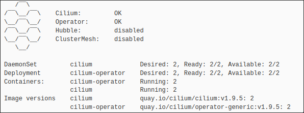

# Installation

What are the binaries and configs we need in order to bootstrap a kubernetes cluster?

### Packages needed

- containerd
- kubelet
- kubeadm
- kubectl


### Containerd

[Containerd](https://containerd.io/) is a container runtime, its one of the most used alongside with [CRI-O](https://cri-o.io/)

Under the assumption of having containerd installed, we still need to do a couple of things

```bash
  sudo mkdir -p /etc/containerd
  sudo containerd config default | sudo tee /etc/containerd/config.toml
  vim config.toml  
  #commnet disabled_plugins[]
  #set SystemdCgroup = true
  #set systemd_cgroup = true
  systemctl restart containerd
```

Before we carry on to more interesting stuff, we still need to do a couple more things:

- Disable swap -> Although swap is now on [beta](https://kubernetes.io/blog/2023/08/24/swap-linux-beta/), I still recommend not using swap, if you dont know what swap is you need to read [this](https://access.redhat.com/documentation/es-es/red_hat_enterprise_linux/7/html/storage_administration_guide/ch-swapspace) 
- Once we have disabled swap we still need to set up the ipv4 bridge, this needs to be done in every node, without any of this the network stack of our cluster wont work
```bash
cat <<EOF | sudo tee /etc/modules-load.d/k8s.conf
overlay
br_netfilter
EOF
sudo modprobe overlay
sudo modprobe br_netfilter
# sysctl params required by setup, params persist across reboots
cat <<EOF | sudo tee /etc/sysctl.d/k8s.conf
net.bridge.bridge-nf-call-iptables  = 1
net.bridge.bridge-nf-call-ip6tables = 1
net.ipv4.ip_forward                 = 1
EOF
# Apply sysctl params without reboot
sudo sysctl --system
```

### Initialize the cluster

Now on the node that acts as a master or control plane, we need to run the following commands

```bash
sudo kubeadm config images pull
sudo kubeadm init --pod-network-cidr=10.244.0.0/16 --apiserver-advertise-address=X.X.X.X
#The advertise address is whatever ip the cp node has
#Enable usage for the current user
mkdir -p $HOME/.kube
sudo cp -i /etc/kubernetes/admin.conf $HOME/.kube/config
sudo chown user:group $HOME/.kube/config
```

After that we need to deploy the [CNI](https://kubernetes.io/docs/concepts/extend-kubernetes/compute-storage-net/network-plugins/) 

The most used CNI Plugins are the following:

- [Calico](https://docs.tigera.io/calico/latest/about/) 
- [Cilium](https://cilium.io/) 
- [Flannel](https://github.com/flannel-io/flannel) 

Nowadays Cilium is gaining a lot of popularity, because out of the box provides a lot of functionalities like a LB or Gateway API, which the other two dont really do.


We are going to install Cilium, take into account that every other option is really good, I think Calico is an extremely good product as well.

In order to install Cilium just do as following:

```bash
CILIUM_CLI_VERSION=$(curl -s https://raw.githubusercontent.com/cilium/cilium-cli/main/stable.txt)
CLI_ARCH=amd64
if [ "$(uname -m)" = "aarch64" ]; then CLI_ARCH=arm64; fi
curl -L --fail --remote-name-all https://github.com/cilium/cilium-cli/releases/download/${CILIUM_CLI_VERSION}/cilium-linux-${CLI_ARCH}.tar.gz{,.sha256sum}
sha256sum --check cilium-linux-${CLI_ARCH}.tar.gz.sha256sum
sudo tar xzvfC cilium-linux-${CLI_ARCH}.tar.gz /usr/local/bin
rm cilium-linux-${CLI_ARCH}.tar.gz{,.sha256sum}
cilium install --version 1.15.4
```

Now that we have a CNI, its time for us to populate our cluster with nodes

On the control plane node run this command

```bash
kubeadm token create --print-join-command
``` 
Copy the output of that command and paste it in every worker node
After that we can test our CNI by running
```bash
cilium status --wait
```

we should see something similar to the following output



We can also see the nodes that are part of our cluster by issuing the following command

```bash
kubectl get no
```

## Considerations


Keep in mind that as a DevOps Engineer or Site Reliability Engineer(SRE), you have to think automation first, this notes are great to understand the installation process
And everything that is needed to have a proper kubernetes cluster, as an engineer in general it is really important to understand the tools that you are working with,
So if you are starting out, you are probably thinking how can I automate this process, well there are a couple of approaches you can have:

1. Using a managed kubernetes service
2. Using a self hosted/on prem kubernetes cluster

Specially if you are just starting out I would recommend against using a managed kubernetes service, since you wont be able to determine whats underneath the hood,
That leads us to the second approach, how can we actually automate this process, well as a somewhat seasoned SRE I would use the following tools:

- [Terraform/OpenTofu](https://opentofu.org/) 
- [Ansible](https://www.ansible.com/) 
- [Git](https://git-scm.com/) 

Terraform/OpenTofu could be used to deploy a managed kubernetes service as well, for an on-prem environment thats running VMware vCenter and some ESXI hosts, we could use
terraform to deploy the vms and use ansible to run all the commands to this newly deployed VMs

You may be asking yourself, but why git? well let me ask you another question, imagine that you have all your files for this project stored locally without a way to keep track of the changes.
You make some changes to those files and now your new update doesnt really work so you need to go back to a previous version of it, without a VCS this is nearly impossible
not only that, what if you want to run this updates just by making some changes in a file and having them in a remote server, this is where [GitOps](https://about.gitlab.com/topics/gitops/) comes to play

Thats one of the reasons why using a VCS like git is really important, not only that but it also enabled working in teams.

Another important consideration regarding VCS and why terraform and tools like it are so important, is having a single source of truth, what I mean by this is when we attempt to have a programmatic approach to our workflow we need to know the [state](https://developer.hashicorp.com/terraform/language/state) taking advantage of terraform, and everyone on our team being able to know whats defined and how was it defined by taking advantage of a repository
![[Pasted image 20240430172619.png]]![[Pasted image 20240430173104.png]]![[Pasted image 20240430173300.png]]![[Pasted image 20240430173348.png]]